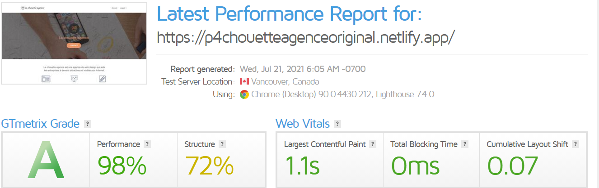

<h1>Projet 4: formation Openclassrooms</h1>
<h2>Optimisez un site web existant</h2>
<h3>Mission</h3>
Vous travaillez pour La chouette agence, une grande agence de web design basée à Lyon. L’activité de l’entreprise a bien démarré mais aujourd’hui, elle est en perte de vitesse. Eh oui, la concurrence est rude. La fondatrice de l’entreprise, Sophie, cherche une solution pour faire repartir l’activité. En tapant “Entreprise web design Lyon” sur Internet, elle s’aperçoit que le site de l’agence apparaît seulement en deuxième page des moteurs de recherche. Par chance, un de vos collègues, Martin, lui a dit que vous étiez un spécialiste en référencement.

<h3>Rapport du site original</h3>

<h3>Rapport du site optimisé</h3>
